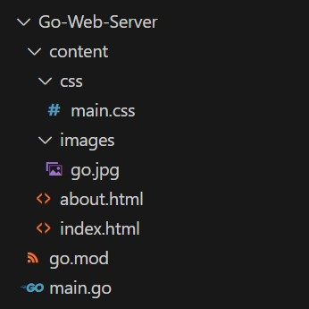
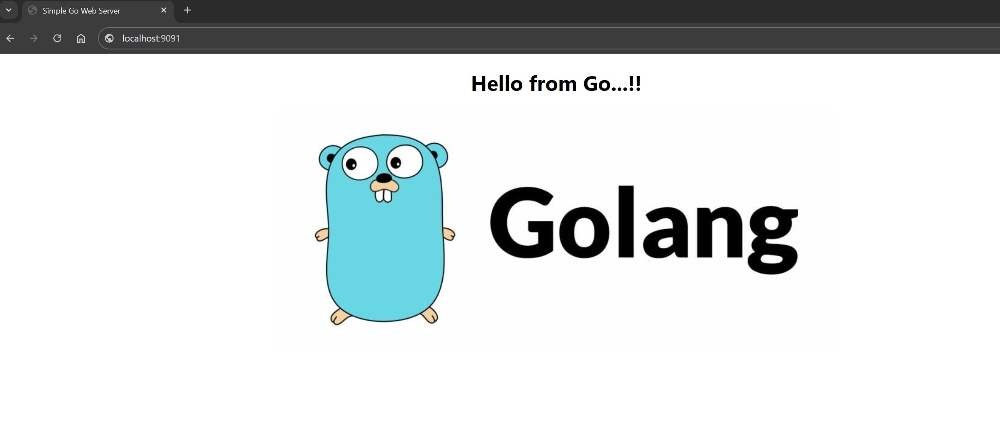
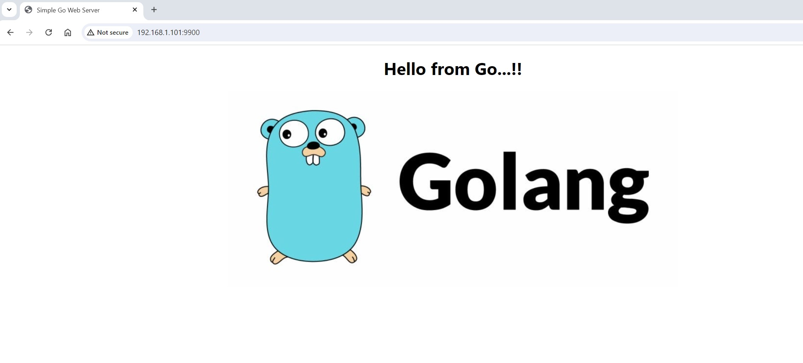

## Create the necessary file structure for Go Web Applicaion


## The content of the application files are below

### main.go
```go
package main

// Import Packages
import (
    "log"
    "net/http"
)

func main() {
    // Server the Desired HTML File
    http.Handle("/", http.FileServer(http.Dir("./content")))
    log.Fatal(http.ListenAndServe(":9091", nil))
}
```

### index.html
```html
<!DOCTYPE html>
<html lang="en">
  <head>
    <title>Simple Go Web Server</title>
    <link rel="stylesheet" href="css/main.css">
  </head>
  <body>
    <h1>Hello from Go...!!</h2>
    <div>
      
    </div>
  </body>
</html>
```

### about.html
```html
<!DOCTYPE html>
<html lang="en">
  <head>
    <title>Simple Go Web Server</title>
  </head>
  <body>
    <h1>Kubernetes Deployment Test</h2>
  </body>
</html>
```

### main.css
```css
h1 {
    text-align: center;
    width: 100%;
    font-family:'Segoe UI', Tahoma, Geneva, Verdana, sans-serif;
}

.center {
    display: block;
    margin-left: auto;
    margin-right: auto;
    width: 50%;
}
```

#### Now if we run the application locally for testing by using the command ``` go run . ``` then we should be able to see the application by usung the web address ```localhost:9091```


## Containerizing go web application
#### Now we need to create a ``` Dockerfile ```
### Dockerfile
```yml
# Base Image
FROM golang:1.22-alpine

# Make app directory
RUN mkdir /app

# Copy all content to the app directory
ADD . /app

# Make app directory the working directory
WORKDIR /app

# Download any required modules
RUN go mod download

# Build the program to create an executable binary
RUN go build -o webserver .

# Set the startup command
CMD ["/app/webserver"]
```
#### Now build the docker image with the command ``` docker build -t go-web-server . ```

#### We can test the docker image locallly by using the command ``` docker run -d --publish 9091:9091 --name go-web go-web-server ```

#### This will also give us the same output in the browser as previously.


## Now it's time to deploy this docker image to our k3d kubernetes cluster
#### First of all we need to install the k3d binaries to the host by using the link 
Then Create the k3d image registry by using following commands 
``` k3d registry create go-app-registry --port 5050 ```
Now we need to link this newly created registry to our local mirror using a file called registries.yaml
#### registries.yaml
```yaml
mirrors:
"localhost:5050":
    endpoint:
      - http://k3d-go-app-registry:5050
```
Now we can create the k3d kubernetes cluster using the below command 
``` k3d cluster create mycluster -p "9900:80@loadbalancer" -s 1 -a 3 --registry-use k3d-go-app-registry:5050 --registry-config registries.yaml ```

We need to push our docker image to the newly created image registry. For that we need tp tag that image accordingly and then push this to registry.
```
docker tag go-web-server:latest localhost:5050/go-web-server:v1.0
docker push localhost:5050/go-web-server:v1.0
```
As of now we have our cluster and image ready for the deployment. So before go further we need tp download kubernetes client binaries to interact with the cluster which is ```kubectl```. The link for that is https://kubernetes.io/docs/tasks/tools/install-kubectl-linux/#install-using-native-package-management

We can now spin up the new deployment object using our image also the service to access this go app 
```
kubectl create deployment go-web-server --image=k3d-go-app-registry:5050/go-web-server:v1.0
kubectl create service clusterip go-web-server --tcp=9091:9091
```
To access this application using our browser we need an ingress service to point ou our loadbalancer. Let's create the ingress object.
#### ingress.yaml
```yaml
apiVersion: networking.k8s.io/v1
kind: Ingress
metadata:
  name: go-web-server
  annotations:
    ingress.kubernetes.io/ssl-redirect: "false"
spec:
  rules:
  - http:
      paths:
      - path: /
        pathType: Prefix
        backend:
          service:
            name: go-web-server
            port:
              number: 9091
```
Now we can deploy this ingress with the following command 
``` kubectl apply -f ingress.yaml ```
### So now all the required steps are done we can use our browser to access our loadbanalcer to access our go-applicaion.

